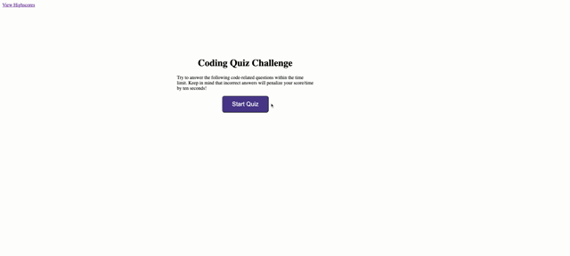

# CodingQuizGame

### Description
* The purpose of this project is to create a coding quiz using Javascript. Within the parameters of creating the quiz, for loops, if-else statements, and setInterval, clearInterval and addeventlistener functions were used. As well, the highscore (remaining time) was tracked within local storage, which had to be stringified and then parsed back out onto the screen. Once the user selects "clear highscores", the local storage has to be cleared.   

### Demonstration
                                                                                                                                                          
 &nbsp;
                                                                                                                                                       

### Deployed Site

* https://stacyo23.github.io/CodingQuizGame/

### Github Page

* https://github.com/stacyo23/CodingQuizGame

